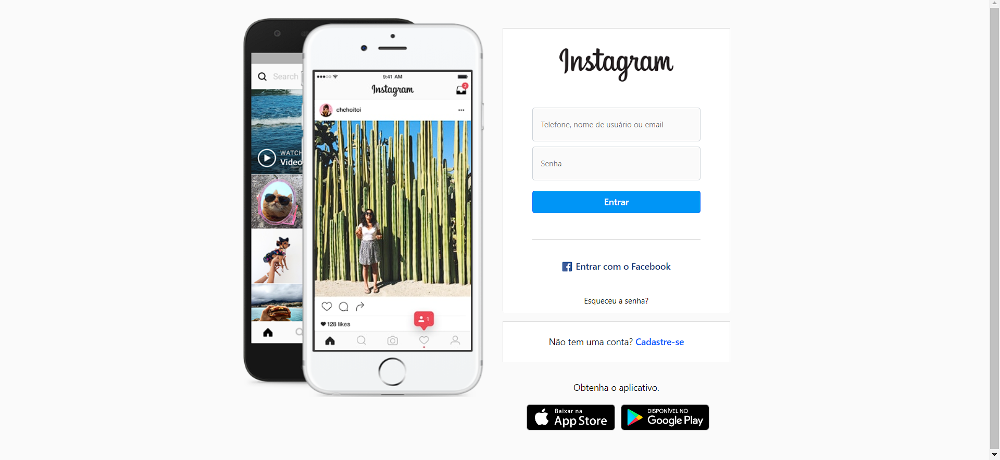
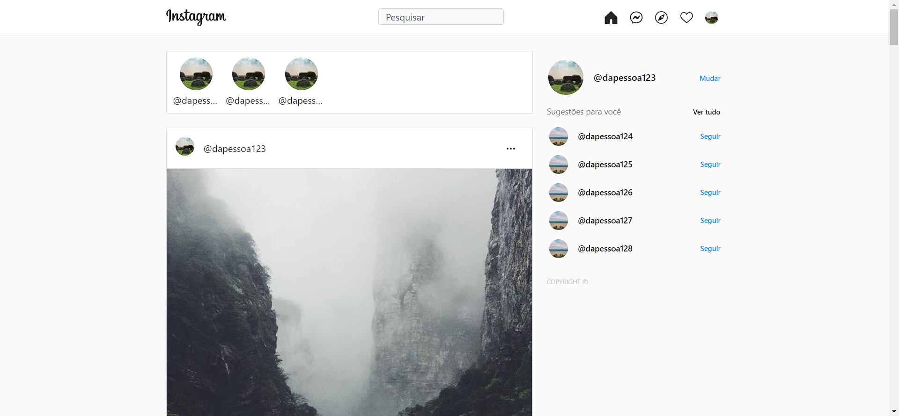

# Instagram Copy

    
    

Cópia do website do Instagram para fins de estudo, este projeto foi realizado durante as aulas.

## :hammer: Funcionalidades do projeto
- `Formulário de cadastro de usuário`: formulário para o cadastro de novos usuários, com criptografia de senha no banco de dados.
- `Sistema de login`: sistema para o usuário poder fazer login na sua conta criada.
- `Função sair da conta`: função para o usuário se desconectar da conta.

 

## :file_folder: Acesso ao projeto
Você pode [acessar o código-fonte do projeto](https://github.com/GabrielSchiavo/instagram-copy) ou [baixá-lo](https://github.com/GabrielSchiavo/instagram-copy/archive/refs/heads/master.zip).

## 	:hammer_and_wrench: Abrir e rodar o projeto
Após baixar o projeto, você pode abrir com o Visual Studio Code. Para o projeto funcionar você deve ter configurado em seu PC:
* PHP - Versão >=8.1.4
* XAMPP
* Banco de Dados MySQL

Após configurar todas essas ferramentas, nos arquivos do projeto edite as configurações de conexão do banco de dados no arquivo connect_db.php localizado em /database para as suas configurações escolhidas durante a instalação do MySQL.

Agora importe as configurações do banco de dados no MySQL, utilizando o arquivo DB_insta_copy.sql, localizado na raiz do projeto.

Depois copie a pasta do projeto renomeando-a para "instagram_copy" e cole na pasta htdocs do XAMPP, normalmente localizada em C:\xampp\htdocs.

Agora é digitar a seguinte URL: "http://localhost/instagram_copy/login.php" em seu navegador e o projeto está pronto para ser usado. 

## :white_check_mark: Tecnologias utilizadas
* `Bootstrap - 5.1.0`
* `CSS 3`
* `HTML 5`
* `MySQL Database`
* `PHP - 8.1.4`
* `XAMPP`
